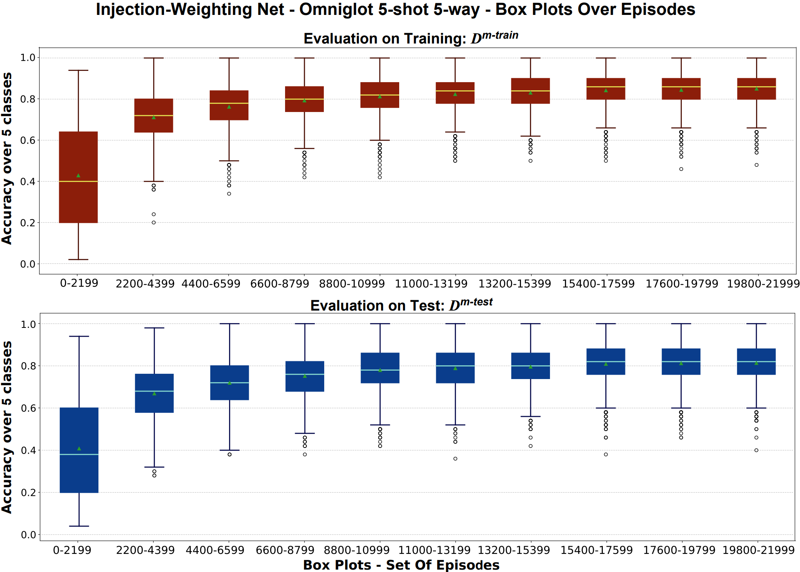

# TF Meta Learning

A collection of both optimization-based and relation-based meta-learning algorithms developed on TensorFlow.

Main Author: Gianfranco Mauro

# Weighting-Injection Net and Model-Agnostic Meta-Weighting (MAMW)

Codes relative to:

Mauro, G., Martinez-Rodriguez, I., Ott, J. et al. 
[Context-adaptable radar-based people counting via few-shot learning.](https://doi.org/10.1007/s10489-023-04778-z) Appl Intell (2023). DOI: 10.1007/s10489-023-04778-z. 

# Reference algorithms

Reptile:
Nichol, Alex, Joshua Achiam, and John
Schulman. ["On first-order meta-learning algorithms."](https://arxiv.org/abs/1803.02999), arXiv preprint arXiv:
1803.02999). Partial re implementation of:
ADMoreau. ["Few-Shot learning with Reptile."](https://keras.io/examples/vision/reptile/)

MAML (1st and 2nd order):
Finn, Chelsea, Pieter Abbeel, and Sergey
Levine. ["Model-agnostic meta-learning for fast adaptation of deep networks."](https://arxiv.org/abs/1703.03400),
International conference on machine learning. PMLR, 2017.

MAML+MSL+CA+DA:
Antoniou, Antreas, Harri Edwards, and Amos Storkey. ["How to train your MAML."](https://arxiv.org/abs/1810.09502),
Seventh International Conference on Learning Representations. 2019.
The following contributes from the paper have been implemented in this tensorflow version of MAML:

1. Multi-Step Loss Optimization (MSL)
2. Cosine Annealing of Meta-Optimizer Learning Rate (CA)
3. Derivative-Order Annealing (DA)

# Requirements

Python >=l 3.6.8

Matplotlib 3.3.1,
Numpy 1.19,
Pillow 7.2.0,
Scipy 1.5.4,
Tensorflow 2.4.1

# Data

All experiments are configured for Omniglot with unresized images so 105x105.
The data can be downloaded from the repository : [Omniglot data](https://github.com/brendenlake/omniglot).

The data in the archive files "images_background.zip" and
"images_evaluation.zip" should be unzipped and placed directly as sub-folders in ```/data"```.

The radar data, utilized in "Context-Adaptable Radar-Based People Counting via Few-Shot Learning", 
are not publicly available due to internal company board~policy (Infineon Technologies AG).

# Prerequisites

- Run ```pip install -r  requirements.txt ```
- Download and store Omniglot data in the ```/data``` folder
- Create a folder ```/results``` to store experiment results (both plots and saved models).
  Results is also automatically created after first experiment completion.

# Code execution

From terminal (Once defined the configurations): ```python "main.py"``` will run the experiment Weighting Network with
default parameters.

### arguments

- ```-- alg (Optional, str, default:weight_net)``` : Meta Algorithm, available meta learning algorithms:
    - weight_net
    - mamw
    - reptile
    - maml2nd
    - maml1st
    - maml_plus.

- ```-- n_ways (Optional, int, default:5)``` : number of ways of the experiment [2, 5, 10, ...].

- ```-- n_shots (Optional, int, default:5)``` : number of shots of the experiment [1, 2, 5, 10, ...].

- ```-- n_tests (Optional, int, default:10)``` : number of test shots per class [1, 2, 5, 10, ...].

- ```-- n_episodes (Optional, int, default:22000)``` : number of episodes per experiment [10, 100, 1000, 22000, ...].

- ```-- n_query (Optional, int, default:1)``` : number of queries of the experiment [1, 2, 5, 10, ...].

- ```-- n_repeats (Optional, int, default:3)``` : number of repetitions of the experiment [1, 2, 5, 10, ...].

- ```-- n_box_plots (Optional, int, default:10)``` : number of box plots for the final accuracy plotting [2, 5, 10, ...]
  .

- ```-- eval_step (Optional, int, default:1)``` : number of episodes before an evaluation step [1, 2, 5, 10, ...].

- ```-- beta1 (Optional, float, default:0)``` : beta1 parameter for Adam [0, 0.1, 0.2, 0.5, 1].

- ```-- beta2 (Optional, float, default:0.5)``` : beta2 parameter for Adam [0, 0.1, 0.2, 0.5, 1].

- ```-- n_fin_episodes (Optional, int, default:10000)``` : number of final test episodes after generalization 
  learning [10, 100, 1000, 10000, ...].
- ```--results_dir (Optional, str, default:results)``` : name of the subdirectory where to save the results.

### Example command

```python main.py --alg=mamw --n_ways=5 --n_shots=5 --n_episodes=22000 --n_fin_episodes=10000```


### Results examples

Each directory containing the results of a single experiment will include a figure of boxplots vs. evaluation episodes.
Red plots represent the evaluation on sampled training tasks. Blue plots instead, represent the evaluation on sampled test tasks.
Each box plot is constructed on the accuracy statistic of a sequence of N episodes. 
This value is generated with respect to the value defined for the "--n_episodes" and "--n_box_plots" arguments.
Median and Average values are stored in the results.txt files.
Here following is an example for a Weighting-Injection Net 5-way 5-shots (Omniglot).

